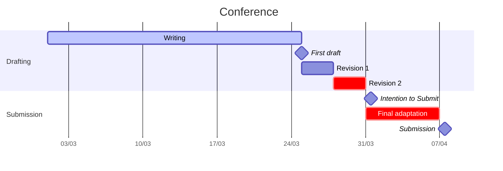

# Operator Assist: A digital assistant for assembly operators

This research project addresses the evolving challenges faced by manufacturing companies in response to a rising demand for intricate products and an expanding array of product variants. The implementation of Industry 4.0 concepts has necessitated assembly operators to acquire additional skills related to their altered roles, leading to a paradigm shift outlined in Industry 5.0. Current support services for assembly operators primarily offer procedural digital instructions, leaving operators to rely on personal knowledge or seek external assistance when issues arise. The untapped potential of digitization in consolidating information from diverse IT systems can significantly enhance operator support.
This project aims to harness this knowledge potential by developing a digital assistant (DA) as a central interface between operators and information sources. The DA, guided by a precise understanding of the assembly's current state, will proactively recommend the next steps for the operator. In instances of challenges, seamless interaction with the DA will provide prompt answers based on its situational comprehension. Beyond enhancing performance metrics such as quality and efficiency, the DA offers operators a sense of reassurance by ensuring timely support. Additionally, it facilitates quicker independence for new operators and boosts supportive staff efficiency by reducing the reliance on external assistance.

## CAISE'24 | 4-7 June 2024 @ Limassol

- Conference: CAISE'24  https://cyprusconferences.org/caise2024/call-for-rpe/
- **Status: preparation**

### Important dates

- Intention to Submit:	1st April, 2024 
- Submission:	8th April, 2024
- Notification of Acceptance:	22nd April, 2024 
- Camera Ready	13th May, 2024
- Author Registration	1st May 2024
- Conference:	3rd-7th June 2024

## Planning 

More info in: [#2](https://github.com/alopezag/paper_OA/issues/2)

## Latex structure

- Main file: [paper_OA.tex](paper_OA.tex)
  + [01_Introduction.tex](01_Introduction.tex)
  + [02_Literature.tex](02_Literature.tex)
  + [03_Methodology.tex](03_Methodology.tex)
  + [04_Results.tex](04_Results.tex)
  + [05_Conclusions.tex](05_Conclusions.tex)

- Reference file: [references.bib](references.bib)
  + Papers: [/ref](/ref)

Link to overleaf (to edit online): 

## Submission system 

## Acknowkledge

This research was funded by Flanders Make organization under the project OperatorAssist_SBO, project number 2021-0133. Flanders Make is the Flemish strategic research center for the manufacturing industry.
