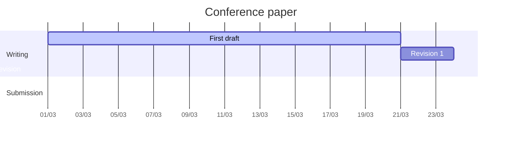

# Operator Assist: A digital assistant for assembly operators

Over the last years, manufacturing companies have experienced an ever-increasing demand for more complex products with an increasing amount of product variants. As a result, the amount of tasks assembly operators need to master is growing accordingly. Introduction of Industry 4.0 concepts and technologies also require operators to acquire a whole new set of skills (e.g., robot programming, data analysis) linked to their changed role and responsibilities within the production environment. The impact of this change cannot be underestimated and is therefore one of the main focus points for innovation in the recently defined Industry 5.0 concept. Currently, assembly operator support services are often limited to providing procedural (digital) work instructions. In case of issues, operators have to rely on their own knowledge and experience or require help from external experts. Digitization offers an enormous potential to provide better insights and support to the operator by gathering information and knowledge that is available in various IT information systems. However today, this potential too often remains untapped.
In this project, we will leverage this knowledge potential to develop a digital assistant (DA) which interacts with the operator and serves as a single-point-of-contact between the operator and various information sources. Based on accurate recognition of the current state of the assembly, the DA will proactively suggest what the operator should do next. When issues arise, the operator will be able to seamlessly interact (“Why doesn’t this part fit?”) with the DA, which relies on its understanding of the situation to provide the operator with the required answers. 
Besides the clear performance gains (quality, efficiency) such a DA also provides reassurance to the operator by knowing they will receive the required support whenever they need it. New operators will be able to work independently more quickly. As an added benefit, the decreased need for external support will increase the efficiency of the supportive staff.

## CAISE'24 | 4-7 June 2024 @ Limassol

- Conference: CAISE'24  https://cyprusconferences.org/caise2024/call-for-rpe/
- **Status: preparation**

### Important dates

- Intention to Submit:	1st April, 2024 
- Submission:	8th April, 2024
- Notification of Acceptance:	22nd April, 2024 
- Camera Ready	13th May, 2024
- Author Registration	1st May 2024
- Conference:	3rd-7th June 2024

## Writing plan

More info in:

## Latex structure

- Main file: [paper_OA.tex](paper_OA.tex)
  + [01_Introduction.tex](01_Introduction.tex)
  + [02_Literature.tex](02_Literature.tex)
  + [03_Methodology.tex](03_Methodology.tex)
  + [04_Results.tex](04_Results.tex)
  + [05_Conclusions.tex](05_Conclusions.tex)

- Reference file: [references.bib](references.bib)
  + Papers: [/ref](/ref)

Link to overleaf (to edit online): 

## Submission system 

## Acknowkledge

Operator Assist SBO.

## LaTeX user template and guide

To compile user guide:

1. `pdflatex sample-1col`
2. `bibtex sample-1col`
3. `pdflatex sample-1col`
4. `pdflatex sample-1col`

and

1. `pdflatex sample-2col`
2. `bibtex sample-2col`
3. `pdflatex sample-2col`
4. `pdflatex sample-2col`

or

use the makefile:

`make`

